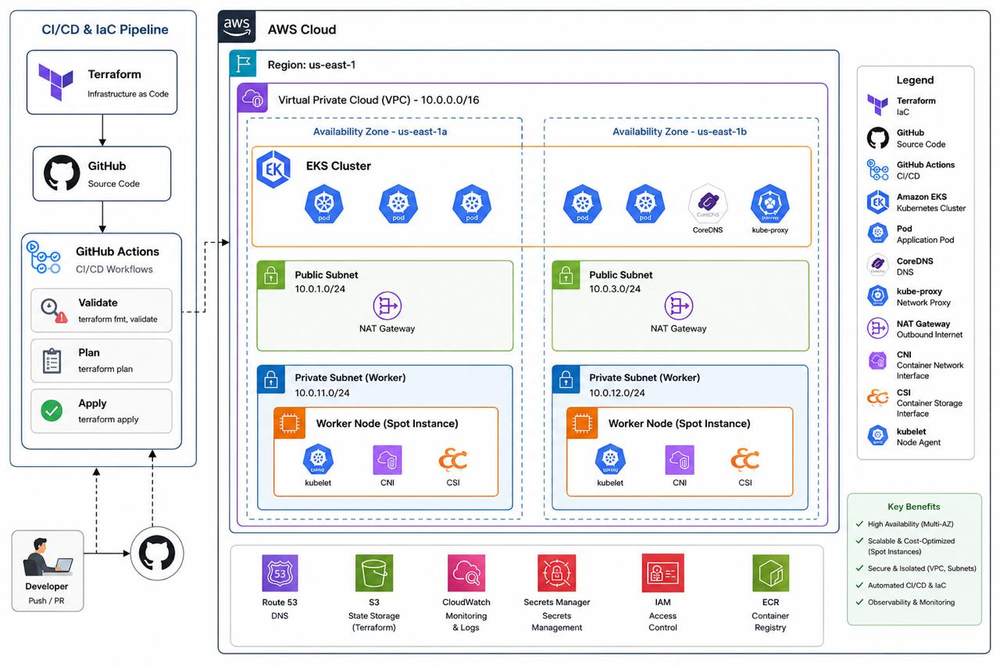

# 🚀 Production-Ready Amazon EKS Cluster with Terraform & GitHub Actions

[](https://www.terraform.io/)
[](https://aws.amazon.com/eks/)
[](https://github.com/features/actions)
[](LICENSE)



## 📌 Project Overview

This repository demonstrates how to provision a **Production-Ready Amazon EKS (Elastic Kubernetes Service)** cluster using **Terraform** and automate infrastructure deployment with **GitHub Actions**.

The project follows **Infrastructure as Code (IaC)** best practices and showcases a real-world DevOps workflow for deploying Kubernetes infrastructure on AWS.

---

# 🏗️ Architecture

```
Developer
     │
     ▼
Git Push
     │
     ▼
GitHub Repository
     │
     ▼
GitHub Actions
     │
     ├── Terraform Format
     ├── Terraform Validate
     ├── Terraform Init
     ├── Terraform Plan
     └── Terraform Apply
             │
             ▼
        AWS Infrastructure
             │
             ▼
     Amazon VPC
             │
             ▼
        Amazon EKS
             │
             ▼
 Kubernetes Worker Nodes
```

---

# ✨ Features

- ✅ Infrastructure as Code using Terraform
- ✅ Production-ready Amazon EKS Cluster
- ✅ Modular Terraform Architecture
- ✅ GitHub Actions CI/CD Pipeline
- ✅ Automated Terraform Validation
- ✅ Automated Infrastructure Provisioning
- ✅ Secure Remote State Management
- ✅ Reusable Terraform Modules
- ✅ IAM Roles and Policies
- ✅ VPC, Subnets & Internet Gateway
- ✅ EKS Managed Node Groups
- ✅ Kubernetes Ready Infrastructure

---

# 🛠️ Tech Stack

| Technology | Purpose |
|------------|----------|
| Terraform | Infrastructure as Code |
| AWS EKS | Kubernetes Cluster |
| AWS VPC | Networking |
| IAM | Access Management |
| GitHub Actions | CI/CD |
| Git | Version Control |
| Kubernetes | Container Orchestration |

---

# 📂 Repository Structure

```
EKS-Terraform-Project
│
├── .github/
│   └── workflows/
│        └── terraform.yml
│
├── modules/
│   ├── eks/
│   ├── vpc/
│   └── iam/
│
├── terraform/
│   ├── main.tf
│   ├── provider.tf
│   ├── variables.tf
│   ├── outputs.tf
│   └── backend.tf
│
├── assets/
│   └── architecturegithubactions.jpeg
│
└── README.md
```

---

# ⚙️ GitHub Actions Workflow

Every push to the repository automatically executes:

- Checkout Repository
- Setup Terraform
- Terraform Format Check
- Terraform Validation
- Terraform Initialization
- Terraform Plan
- Terraform Apply *(Optional for Production)*

This enables a fully automated Infrastructure-as-Code deployment pipeline.

---

# 🚀 Deployment

Clone the repository

```bash
git clone https://github.com/darshant15/EKS-Terraform-Project.git

cd EKS-Terraform-Project
```

Initialize Terraform

```bash
terraform init
```

Validate

```bash
terraform validate
```

Plan

```bash
terraform plan
```

Apply

```bash
terraform apply
```

---

# 📈 CI/CD Flow

```
Developer
    │
    ▼
Git Push
    │
    ▼
GitHub Actions
    │
    ├── terraform fmt
    ├── terraform validate
    ├── terraform init
    ├── terraform plan
    └── terraform apply
            │
            ▼
AWS Infrastructure
            │
            ▼
Amazon EKS Cluster
```

---

# 🔒 Best Practices Implemented

- Infrastructure as Code (IaC)
- Modular Terraform Design
- GitHub Actions Automation
- Version Controlled Infrastructure
- Production-ready Architecture
- Reusable Modules
- Secure IAM Configuration
- Automated Validation

---

# 📚 Learning Outcomes

This project demonstrates hands-on experience with:

- Terraform Modules
- Amazon EKS
- GitHub Actions
- AWS IAM
- AWS VPC
- Kubernetes Infrastructure
- CI/CD Automation
- Infrastructure Provisioning

---

# 🤝 Contributing

Contributions, suggestions, and improvements are always welcome.

1. Fork the repository
2. Create a feature branch
3. Commit your changes
4. Push to your branch
5. Open a Pull Request

---

# 📄 License

This project is licensed under the Apache 2.0 License.

---

# 👨‍💻 Author

**Darshan T**

Associate DevOps Engineer

- GitHub: https://github.com/darshant15
- LinkedIn: https://www.linkedin.com/in/darshant1501/

---

⭐ If you found this project useful, don't forget to **Star** the repository!
